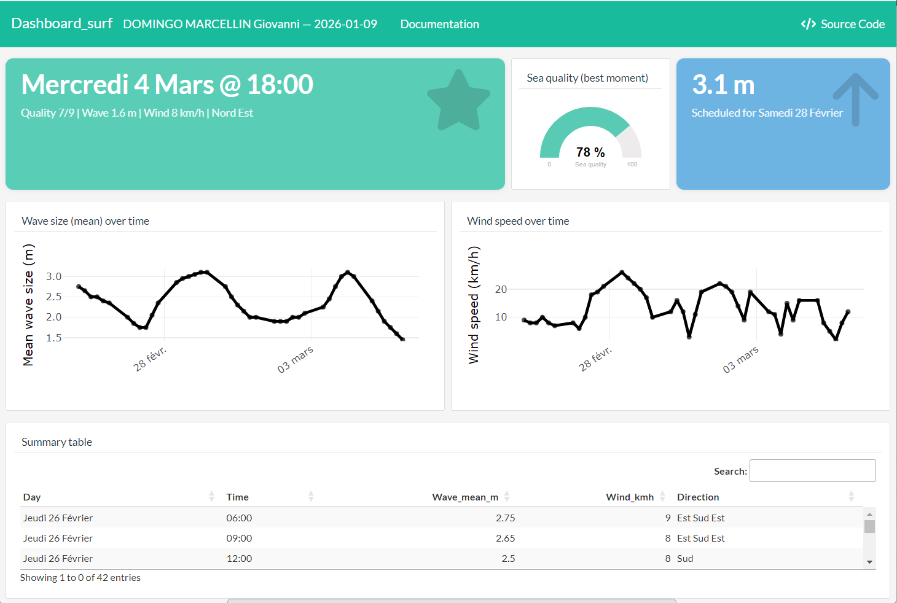

# Surf Forecast Dashboard — R flexdashboard + Python scraping

<center>

**Can you identify the best surf time slot for the next week in Lacanau from scraped wave & wind forecasts?**

</center>

***



## **Overview:**

<div style='text-align: justify;'>

This project delivers a decision-oriented dashboard to monitor and summarize the next-week surf forecast for **Lacanau**. It combines a lightweight **Python web-scraper** (to extract forecast tables from Surf-Report) with an **R flexdashboard** that computes key indicators and highlights the **best time slot** to surf under a simple scoring rule. The dashboard displays wave and wind time series, a summary table, and KPI boxes (best moment, sea quality score, highest wave).

The data pipeline is designed to be transparent and reproducible: **scrape → export CSV → parse/transform → compute KPIs → visualize**. The scoring logic is intentionally simple (assignment-style) and can be adapted (e.g., stricter wind direction constraints, alternative wave thresholds, or multi-objective rules).

</div>

---

## **Live demo**
- **Live dashboard (RPubs):** https://rpubs.com/echo-charbel/1402982  

---

## **Economic & practical relevance**
- **Decision support:** helps quickly identify actionable time slots under multiple constraints (waves, wind speed, wind direction).
- **Automation:** replaces manual browsing and copy/paste by a reproducible extraction + reporting pipeline.
- **Scalability:** the approach generalizes to other surf spots with minimal changes (URL + parsing rules).

---

## **Dataset**
- Source: Surf-Report forecast page for Lacanau  
- Input: HTML forecast table (URL parameter `--url`)  
- Output: CSV file (`data/data_surf.csv` by default) with day, time, wave range, wind speed, wind direction.

---

## **Pipeline (Scrape → Dashboard)**
1. **Scraping (Python)**: download HTML and parse the forecast table  
2. **Export (Python)**: write the extracted data to CSV (`data/data_surf.csv`)  
3. **Parsing (R)**: convert raw strings into numeric variables  
4. **Feature engineering (R)**:
   - `Wave_Size_Mean`: mean of wave range (e.g., “0.8m - 0.7m” → 0.75)
   - `Wind_speed_num`: numeric wind speed (km/h)
   - `DateTime`: reconstructed timestamp from French date label + time slot  
5. **KPIs (R)**:
   - Best moment (max Quality)
   - Sea quality gauge (0–100%)
   - Highest wave (max wave mean)  
6. **Visualization (R)**: interactive time series + summary table (DT)

---

## **Best output (Dashboard KPIs)**
- **Best moment:** time slot maximizing the **Quality** score (0–9), optionally under a strict “Nord” wind-direction constraint.
- **Sea quality gauge:** `100 × Quality/9`
- **Highest wave:** maximum observed `Wave_Size_Mean` over the forecast horizon.

---

## **Data dictionary (main variables)**

<table>
    <tr>
        <th><center> Variable </center></th>
        <th><center> Type </center></th>
        <th><center> Description </center></th>
        <th><center> Units </center></th>
    </tr>
    <tr><td><center> Day </center></td><td><center> string </center></td><td><center> Forecast day label (French) scraped from the website </center></td><td><center> — </center></td></tr>
    <tr><td><center> Hour </center></td><td><center> string </center></td><td><center> Time slot label (e.g., 06:00, 09:00, …) </center></td><td><center> — </center></td></tr>
    <tr><td><center> Waves_size </center></td><td><center> string </center></td><td><center> Raw wave range (e.g., “0.8m - 0.7m”) </center></td><td><center> m </center></td></tr>
    <tr><td><center> Wind_speed </center></td><td><center> string </center></td><td><center> Raw wind speed (e.g., “24 km/h”) </center></td><td><center> km/h </center></td></tr>
    <tr><td><center> Wind_direction </center></td><td><center> string </center></td><td><center> Raw wind direction label (e.g., “Ouest Nord Ouest”) </center></td><td><center> — </center></td></tr>
    <tr><td><center> Wave_Size_Mean </center></td><td><center> numeric </center></td><td><center> Mean of the wave range parsed from Waves_size </center></td><td><center> m </center></td></tr>
    <tr><td><center> Wind_speed_num </center></td><td><center> numeric </center></td><td><center> Numeric wind speed parsed from Wind_speed </center></td><td><center> km/h </center></td></tr>
    <tr><td><center> DateTime </center></td><td><center> datetime </center></td><td><center> Reconstructed timestamp used for plotting </center></td><td><center> — </center></td></tr>
    <tr><td><center> Quality </center></td><td><center> integer </center></td><td><center> Surf quality score in 0–9 (direction + waves + wind speed) </center></td><td><center> — </center></td></tr>
</table>

---

## **Sea quality score (0–9)**
- **Direction:** +3 if wind direction contains “Nord”, else 0  
- **Waves:** +3 if ≤ 1.0m; +2 if ≤ 1.5m; +1 if ≤ 2.0m; else 0  
- **Wind speed:** +3 if ≤ 10; +2 if ≤ 25; +1 if ≤ 50; else 0  

Total: `Quality = score_dir + score_wave + score_wind` in {0,…,9}.  
Gauge value: `100 × Quality/9`.

---

## **Repository structure**
```text
.
├─ dashboard/
│  └─ Dashboard.Rmd
├─ python/
│  ├─ run_surf_scrap.py
│  └─ surf_scrap/...
├─ data/                  # optional (snapshot CSV or outputs)
├─ assets/
│  └─ banner.png
├─ requirements.txt        # Python dependencies
└─ README.md
